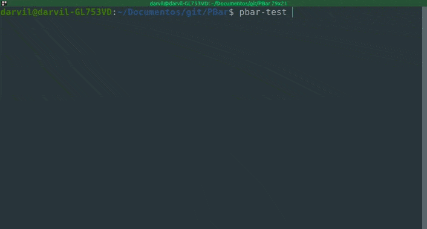

# PBar
PBar is a work in progress python module to display highly customizable progress bars on the terminal.

## Example
### This code here...
```py
from pbar import PBar
from time import sleep


mybar = PBar(
	range=(0, 25),
	text="Loading...",
	charset="normal",
	length=50,
	position=("center", "center")
)


print("BEFORE")


while mybar.percentage < 100:
	sleep(0.1)
	mybar.colorset = {
		"full":		(0, mybar.percentage * 2, 0),
		"empty":	(255 - mybar.percentage * 2, 0, 0)
	}
	mybar.step()
else:
	mybar.text = "Done!"
	mybar.colorset |= {
		"text": {"outside":		(0, 255, 0)}
	}
	mybar.step()

	sleep(1)
	mybar.clear()


print("AFTER")
```
### will generate something like this:




## Requirements
Python 3.9


## Additional Credits
| User       | Task          |
|------------|---------------|
| DrMeepster | Type Checking |
